# 🎵 Aura — Music Player

[](https://github.com/Mena-Shafik/MusicPlayer/actions/workflows/android-ci.yml)

**Aura** is a native Android music player developed in **Kotlin** with **Jetpack Compose**. It supports on-device music playback, internet radio streaming, and integration with self-hosted **Navidrome** servers. Audio playback runs in dedicated foreground services, providing uninterrupted background playback with full media-notification controls.

**Version:** 2.1.0

---

## ✨ Features

### 🎶 Local Library
- Automatic indexing of on-device audio via `MediaStore`
- Library views by song, **album**, **artist**, and **era**
- Full-text song search
- Optional album-art–derived color theming for library entries

### ⏯️ Playback
- Persistent mini player that expands into a full-screen player through a drag gesture
- Now Playing views for **Up Next**, **Lyrics**, and **Related** tracks
- Shuffle and repeat modes
- Lock-screen and notification controls via `MediaSession`
- Automatic pause and resume during phone calls

### 📻 Internet Radio
- Station directory powered by the [Radio Browser API](https://www.radio-browser.info/), with a bundled default station list as fallback
- Media3 ExoPlayer streaming with automatic fallback to `MediaPlayer`
- Dedicated radio notification with independent playback controls
- Mutually exclusive playback: starting local playback pauses the active radio stream

### ☁️ Navidrome Streaming
- Connection to Navidrome and other Subsonic-compatible servers from **Settings → Streaming**
- Credentials secured with `EncryptedSharedPreferences`
- Unified library filtering across **All**, **On Device**, and **Catalogue** sources

### 📂 Playlists & History
- Playlist creation, management, and playback, persisted with Room
- Listening history

### 🎨 Personalization
- Animated "Aurora" background with selectable color palettes
- Configurable library sorting and grouping
- Selectable radio source (bundled or online station list)

---

## 🖼️ Screenshots

<table>
  <tr>
    <td align="center">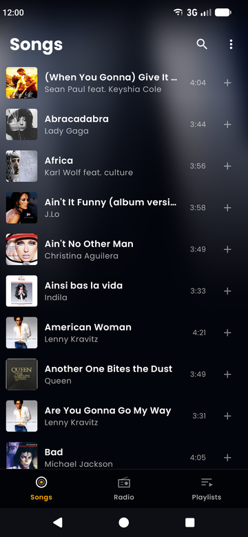<br/><sub>Home</sub></td>
    <td align="center">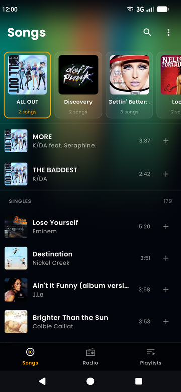<br/><sub>Albums</sub></td>
    <td align="center">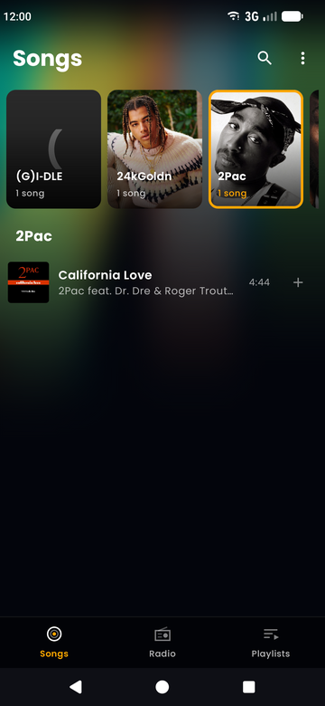<br/><sub>Artists</sub></td>
    <td align="center">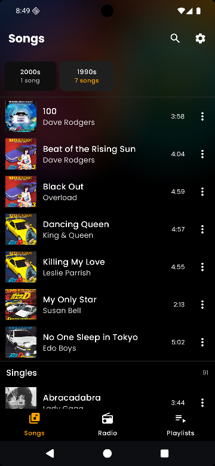<br/><sub>Eras</sub></td>
    <td align="center">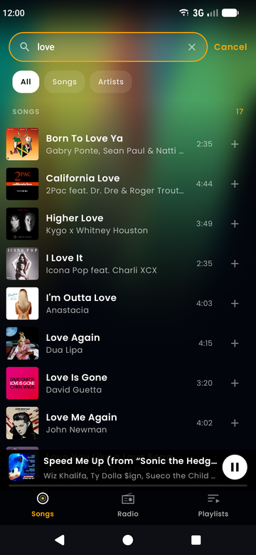<br/><sub>Search</sub></td>
    <td align="center">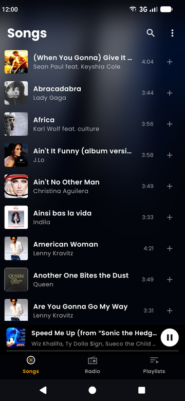<br/><sub>Mini player</sub></td>
    <td align="center">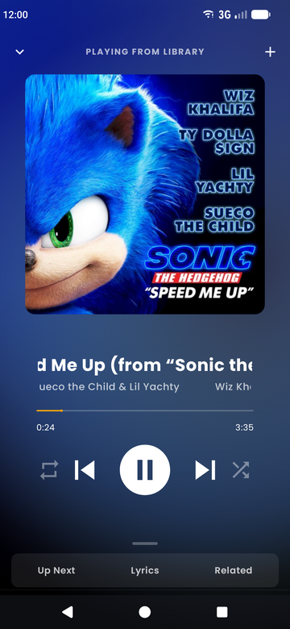<br/><sub>Now playing</sub></td>
    <td align="center">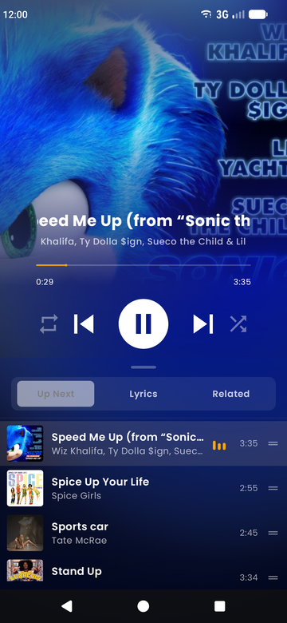<br/><sub>Up next</sub></td>
    <td align="center">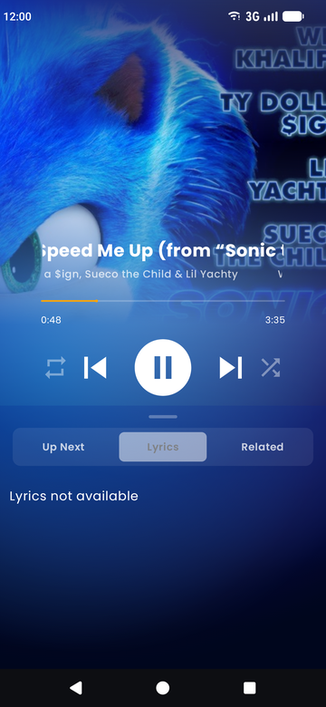<br/><sub>Lyrics</sub></td>
    <td align="center">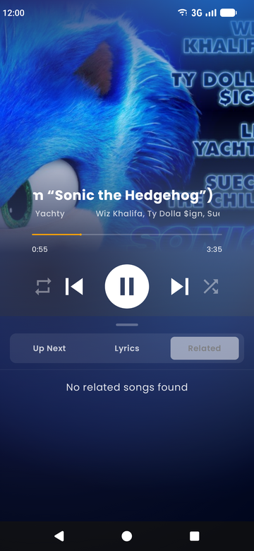<br/><sub>Related</sub></td>
    <td align="center">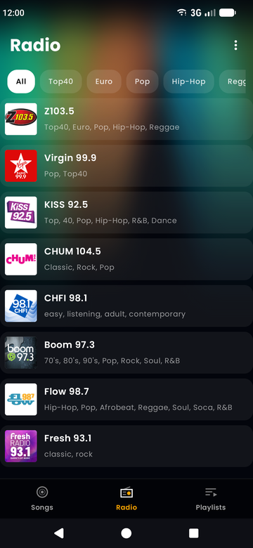<br/><sub>Radio stations</sub></td>
    <td align="center">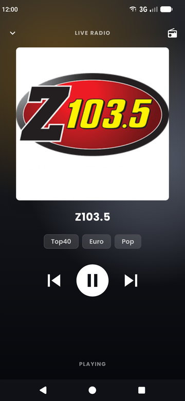<br/><sub>Radio player</sub></td>
    <td align="center">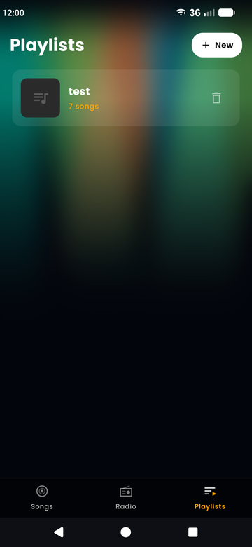<br/><sub>Playlists</sub></td>
    <td align="center">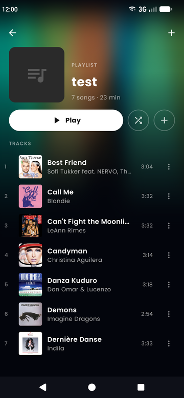<br/><sub>Playlist detail</sub></td>
    <td align="center">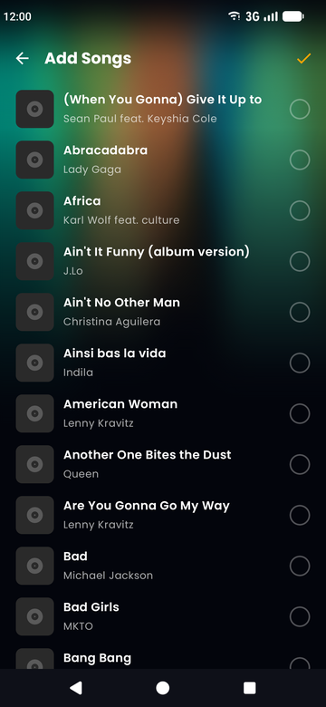<br/><sub>Add songs</sub></td>
    <td align="center">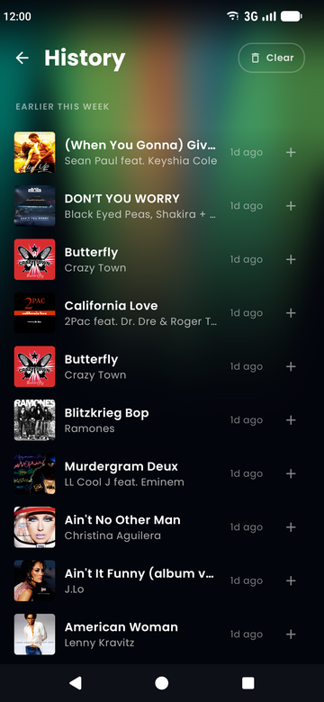<br/><sub>History</sub></td>
    <td align="center">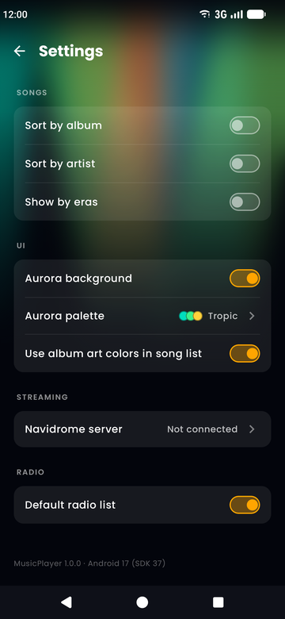<br/><sub>Settings</sub></td>
    <td align="center">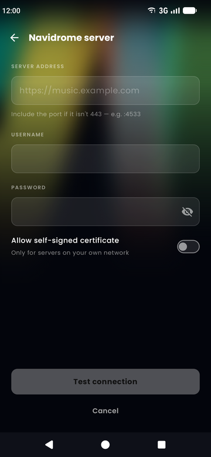<br/><sub>Navidrome connect</sub></td>
    <td align="center">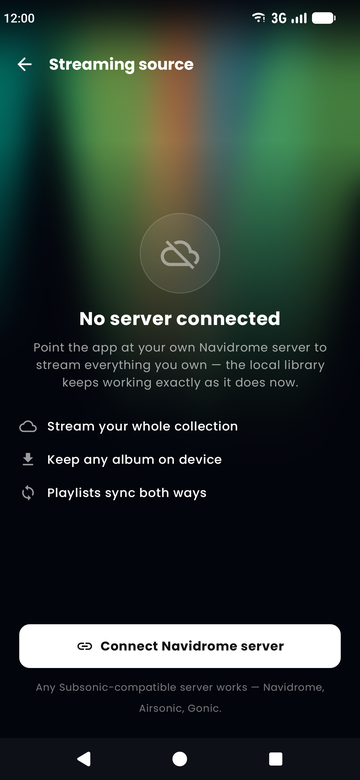<br/><sub>Navidrome connected</sub></td>
  </tr>
</table>

---

## 🛠 Tech Stack

| Area | Technology |
|---|---|
| Language | Kotlin |
| UI | Jetpack Compose, Material 3 |
| Architecture | MVVM + Repository (no DI framework) |
| Navigation | Navigation Compose |
| Local playback | `MediaPlayer` + `MediaSessionCompat` in a foreground service |
| Radio playback | Media3 ExoPlayer (with a `MediaPlayer` fallback) in a foreground service |
| Persistence | Room (playlists, history), DataStore Preferences (settings, last route) |
| Networking | Radio Browser API, Subsonic API (Navidrome), lyrics.ovh |
| Build | Gradle Kotlin DSL, version catalog, kapt for Room |
| CI | GitHub Actions: lint, unit tests, debug APK |

---

## 🧠 Architecture

```
UI (Compose screens)  ──►  ViewModels  ──►  Repositories  ──►  Room / DataStore / Network
         │
         └─ observes ──►  PlayerStateManager (StateFlows) ◄── PlayerForegroundService  (local + Navidrome)
         └─ polls    ──►  RadioPlayerService companion state                            (radio)
```

- **Two independent playback pipelines.** Local music uses `PlayerForegroundService`, which publishes its state through the `PlayerStateManager` singleton of `StateFlow`s. Radio uses `RadioPlayerService`, which exposes its state as static fields that `RadioPlayerViewModel` polls. Each service manages its own audio focus.
- **Navidrome songs reuse the local pipeline.** A remote song's `path` is an authenticated Subsonic stream URL, so `PlayerForegroundService` plays it like any other URI.
- **Navigation lives in `MainActivity`.** Routes are defined in `navigation/NavRoutes.kt` and registered in the `NavHost` inside `MainActivity.onCreate()`.
- **No cached song repository.** Screens query `MediaStore` directly through `util/Util.getAllAudioFromDevice()`.

---

## 📁 Project Structure

```
app/src/main/java/com/example/musicplayer/
├── data/room/        # Room database, entities, DAOs
├── history/          # Listening history screen, ViewModel, repository
├── model/            # Song, Playlist, Artist, RadioStation
├── music/            # Now Playing screen, persistent mini/full player host
├── navidrome/        # Navidrome/Subsonic API, credentials, connect screen
├── navigation/       # NavRoutes + persisted last route
├── playlist/         # Playlist list/detail screens, ViewModel, repository
├── preferences/      # DataStore-backed settings
├── radio/            # Radio API, repository, service, screen, ViewModel
├── service/          # Local playback service, state manager, notifications
├── settings/         # Settings screen
├── songlist/         # Library, search results, radio list
├── ui/
│   ├── components/   # Shared composables (background, common, player, playlist, radio, song)
│   └── theme/        # Colors, typography, theme
├── util/             # MediaStore, bitmap, artist-grouping, lyrics helpers
├── MainActivity.kt   # Entry point + NavHost
└── MainViewModel.kt  # Splash/loading state
```

---

## ▶️ Getting Started

### Requirements
- Android Studio (current stable release; the project uses AGP 9.x)
- JDK 17+
- A device or emulator running **Android 16 (API 36)** or later (`minSdk = 36`, `targetSdk = 37`)

### Build & Run

```bash
git clone https://github.com/Mena-Shafik/MusicPlayer.git
cd MusicPlayer
./gradlew assembleDebug          # Windows: gradlew.bat assembleDebug
./gradlew installDebug           # install on a connected device
```

Alternatively, open the project in Android Studio and run the `app` configuration.

On first launch, grant the requested audio and notification permissions to enable library access and playback controls.

### Common Commands

```bash
./gradlew testDebugUnitTest      # JVM unit tests
./gradlew lintDebug              # Android Lint (enforced in CI)
./gradlew connectedAndroidTest   # Instrumented tests (requires a device)
./gradlew assembleRelease        # Release APK
```

The application version is defined in `gradle.properties` (`VERSION_NAME`, `VERSION_CODE`).

---

## 🚀 Continuous Integration

`.github/workflows/android-ci.yml` runs on every push and pull request to `main`, `master`, and `develop`, and consists of three jobs:
1. **Lint** — `lintDebug`
2. **Unit tests** — `testDebugUnitTest`
3. **Assemble** — `assembleDebug`, with the resulting APK published as a build artifact
